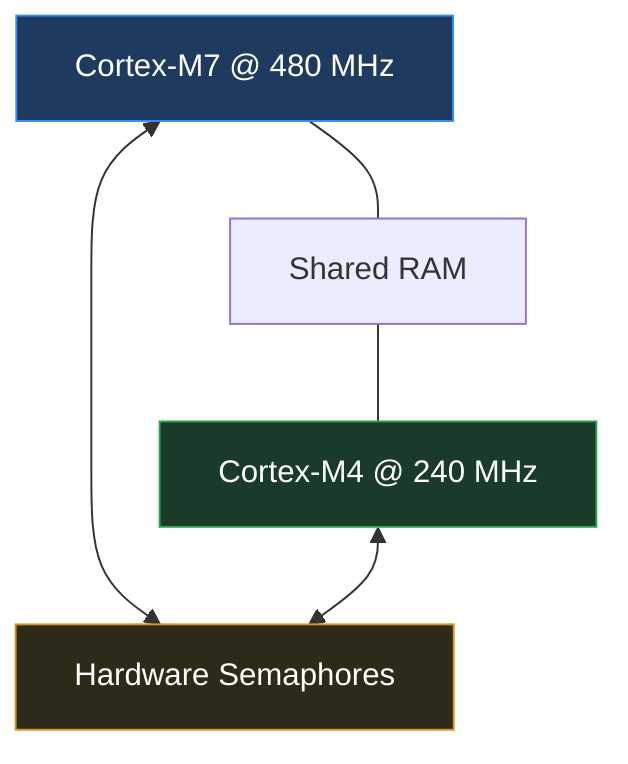

# Firmware Overview
{: .no_toc }

The firmware runs on the **STM32H7 dual-core** with Cortex-M7 as the main core and Cortex-M4 as auxiliary.

---

## Core Split
{: .fs-6 }

Both cores synchronize via **Hardware Semaphores (HSEM)** to prevent shared memory corruption.

| Core | Clock | Role |
|---|---|---|
| Cortex-M7 | 480 MHz | FreeRTOS + LwIP + micro-ROS XRCE-DDS |
| Cortex-M4 | 240 MHz | Auxiliary / future expansion |

---

## Memory Map
{: .fs-6 }

The STM32H755 memory is partitioned to support dual-core operation and Ethernet DMA.

```mermaid
graph LR
    subgraph D1["Domain D1 (High Speed)"]
        M7_Code[AXI SRAM: CM7 Program]
    end
    subgraph D2["Domain D2 (Communication)"]
        ETH_DMA[SRAM2: Ethernet DMA]
        M4_Code[SRAM1: CM4 Program]
    end
    subgraph D3["Domain D3 (Always On)"]
        Shared[SRAM4: Shared Data]
    end

    style D1 fill:#0d1117,stroke:#388bfd
    style D2 fill:#0d1117,stroke:#2ea44f
    style D3 fill:#0d1117,stroke:#d29922
```

---

## Software Stack (CM7)

The CM7 core handles all communication using the LwIP UDP stack.

```mermaid
flowchart TB
  subgraph CM7["Cortex-M7 Stack"]
    FreeRTOS[FreeRTOS Task] --> XRCE["XRCE-DDS Transport"]
    XRCE --> LwIP["LwIP UDP Stack"]
    LwIP --> EMAC["Ethernet MAC"]
  end
  subgraph Net["Network"]
    Agent["micro-ROS Agent"]
  end
  EMAC -->|"UDP :8888"| Agent

  style CM7 fill:#0d1117,stroke:#388bfd
  style Net fill:#0d1117,stroke:#2ea44f
```

---

## Build Output

| File | Purpose |
|---|---|
| `MicroRosEth_CM7.elf` | CM7 debug + symbol file |
| `MicroRosEth_CM7.bin` | CM7 raw binary |
| `MicroRosEth_CM4.elf` | CM4 debug + symbol file |
