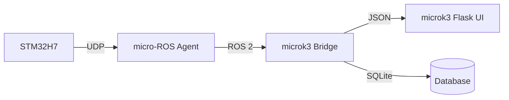

# microk3 Overview
{: .no_toc }

**microk3** is a lightweight Flask-based dashboard and rclpy-powered bridge that monitors micro-ROS nodes.

---

## Live Dashboard
{: .fs-6 }

The dashboard provides a real-time view of all nodes, their health scores, and recent failures.


*Above: The microk3 web interface showing active nodes and system status.*

---

## Architecture



The bridge task (powered by `rclpy`) subscribes to ROS 2 topics and persists status updates to a local JSON file or SQLite database.

---

## REST API Integration

The dashboard exposes a REST API that can be consumed by other services for automated health monitoring.

[View API Reference](api.html){: .btn .btn-outline }

---

## Quick Setup

```bash
cd microk3
python3 -m venv venv
source venv/bin/activate
pip install -r requirements.txt
python3 app.py
```
