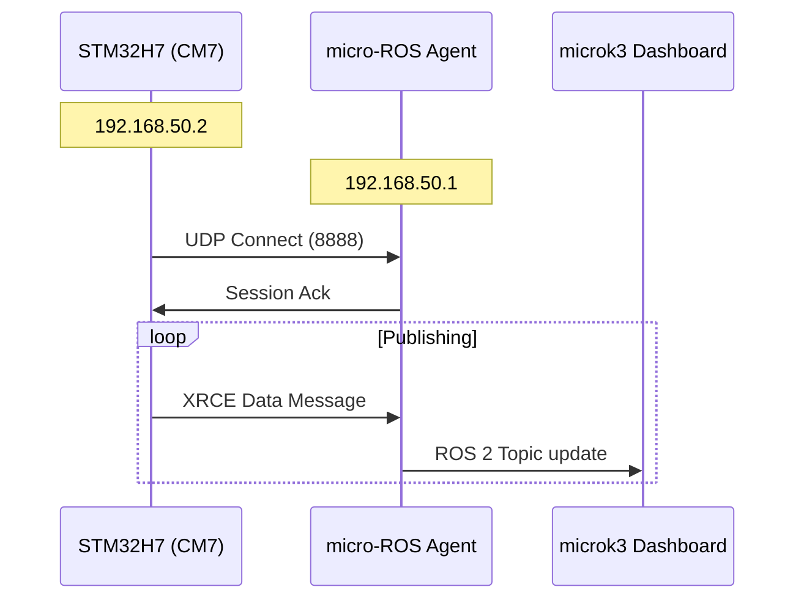
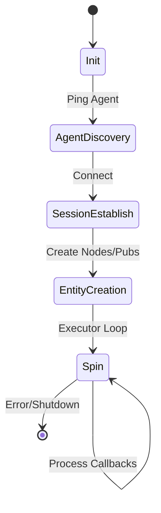

# micro-ROS Overview
{: .no_toc }

The firmware implements a micro-ROS **XRCE-DDS client** over UDP/Ethernet.

---

## Data Flow

The system communicates with a host agent residing on the same subnet (`192.168.50.x`).

---

## RMW Configuration

The Client library is tuned for STM32 memory constraints.

| Parameter | Value |
|---|---|
| Max nodes | 1 |
| Max publishers | 5 |
| Max subscriptions | 5 |
| Max services | 1 |
| Max history | 4 |
| Transport | Custom (UDP over LwIP) |
| Serial profile | Disabled |

---

## Client Lifecycle

