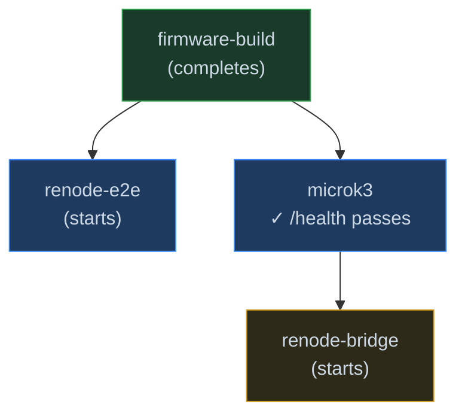

# Production Overview
{: .no_toc }

Deployment notes for the Jetson Orin NX stack and Hardware-in-the-Loop (HIL) workflows.

---

## Startup Sequence

The system follows a strict dependency chain during startup to ensure all network bridges are ready before the firmware simulation or hardware begins publishing.

---

## Services Reference

| Service | Image | Port | Role |
|---|---|---|---|
| `firmware-build` | `Dockerfile.firmware-build` | — | Compiles CM4 + CM7 ELFs on first run |
| `microk3` | `microrosWs/microk3/Dockerfile` | **5050** | Flask dashboard & ROS bridge |
| `renode-bridge` | Same as microk3 | — | Bridges Renode heartbeat → ROS 2 topics |
| `renode-e2e` | `Dockerfile.renode-e2e` | — | Privileged Renode sim with TAP networking |

---

## Deployment Modes

1.  **Simulation Mode**: Everything runs in Docker on the Jetson Orin NX using Renode.
2.  **HIL Mode**: `renode-e2e` is disabled; STM32H7 hardware is connected via physical Ethernet.
